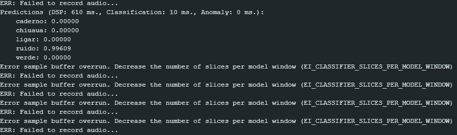
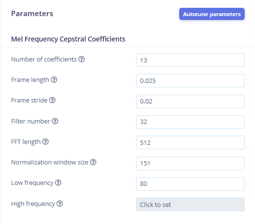
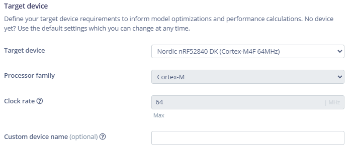

# MODELOS XIAO CHIUAUA
Esse repositório apresenta os modelos de reconhecimento de voz desenvolvidos para a placa de desenvolvimento **XIAO Ble Sense** usando o software web **Edge Impulse**, que permite o desenvolvimento de projetos de IA e Aprendizagem de Máquina para sistemas embarcados.  

### V1
A primeira versão do projeto foi desenvolvida com audios de um banco de dados do google chamado speech_commands, que fornece uma grande quantidade de áudios de pessoas falando diferentes frases.

Esse projeto, apesar de apresentar alta acurácia de 86% no próprio Edge Impulse, ao transferir o modelo para a placa de desenvolvimento, sua responsividade e assertividade não produziram bons resultados.

### V2
A Segunda versão foi desenvolvida com audios gravados no próprio computador e em português. O áudio foi gravado direto no site do Edge Impulse que possibilita a gravação de áudios e organização do banco de dados.

Seus problemas foram iguais aos do modelo V1

### V3
A terceira versão utiliza audios gravados direto da placa de desenvolvimento, o que provê maior assertividade e compreensão do modelo de aprendizagem de máquina. Usando o próprio microfone da XIAO (PDM), foi notável grande avanço na responsividade e assertividade dos comandos.

### V4
Melhora da versão V3 com incrementação de dados de voz e dados de ruido de fundo, que ajudaram na acuracia do projeto.

### V5 
Melhora na versão V4 com maiores dados de áudio e de ruido de fundo.

### V6
Nova versão com novos áudios de voz e ruído de fundo. A configuração do modelo não condiz com as especificações da placa. Erro no buffer de áudio da placa.

#### *Imagem do erro:*

#### *Configurções usadas:*

    
     

### V7
Versão com correção do erro anterior.